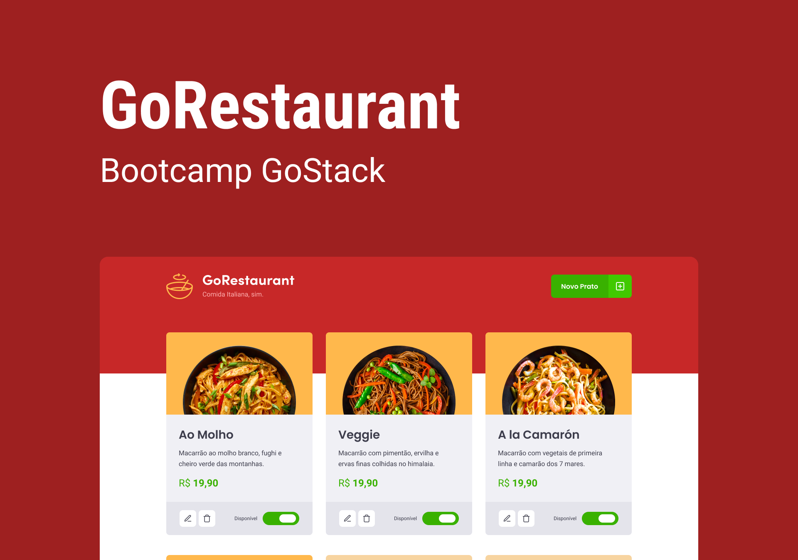
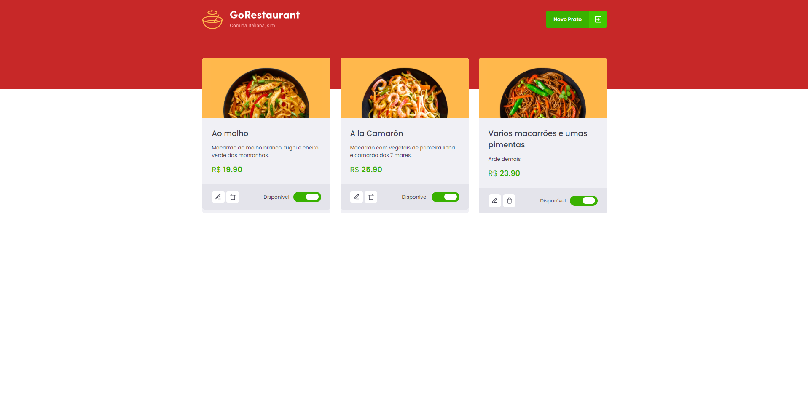
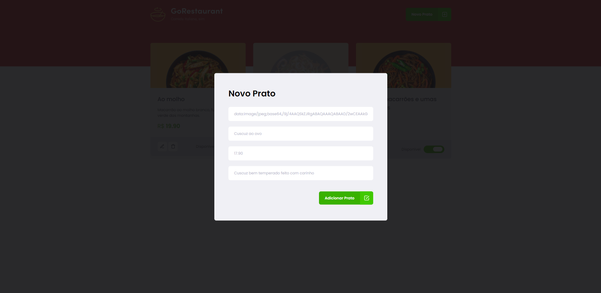
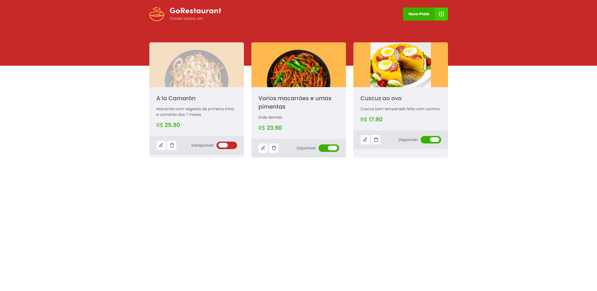

# GoRestaurant   

  

  

  

  

* [Content (en-US)](#secao-en_us)
* [Conteúdo (pt-BR)](#secao-pt_br)

## About the project 

GoRestaurant is a simple CRUD foods system, made as challenge from Rocketseat's GoStack bootcamp. The goal of this challenge was to implement features capable of accessing the backend and performing the appropriate CRUD functions in the frontend of the foods management system.

## Content
  * [How to run the project](#installation)

## How to run the project 
To run the project, you'll need to have Node and NPM or Yarn installed to setup all the dependencies.

Install all dependencies using the `yarn` command, open a new terminal tab on project folder, and run `yarn json-server server.json -p 3333` to run the json server used as API. After, open another terminal tab and run `yarn start` to open the web page.

---

## Sobre o projeto 

GoRestaurant é sistema de CRUD de pratos simples, feito como desafio do bootcamp GoStack da Rocketseat. O objetivo desse desafio era implementar funções capazes de acessar o back-end e executar as devidas funções de CRUD no front-end do sistema de gerenciamento de pratos.

## Conteúdos
  * [Como executar o projeto](#instalacao)

## Como executar o projeto 
Para executar o projeto, você irá precisar ter o Node e o NPM ou Yarn instalados para baixar as dependências.

Instale todas as dependencias utilizando o comando `yarn`, abra uma nova aba do terminal na pasta do projeto, e execute `yarn json-server server.json -p 3333` para rodar o servidor json usado como API. Depois, abra outra aba do terminal e execute `yarn start` para abrir a página web.

---
###### Developed on GoStack Bootcamp from [RocketSeat](https://rocketseat.com.br) :rocket:.
